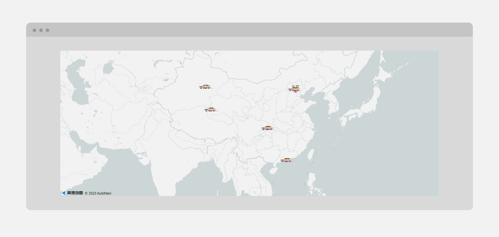

# amap-use-lottie

高德地图中使用lottie动画案例

高德的KEY和SECURITY_JSCODE需配置在环境变量文件中
```js
VITE_AMAP_SECURITY_JSCODE = ''
VITE_AMAP_KEY = ''
```

[]()
## Project Setup

```sh
pnpm install
```

### Compile and Hot-Reload for Development

```sh
pnpm dev
```

### Compile and Minify for Production

```sh
pnpm build
```

### Lint with [ESLint](https://eslint.org/)

```sh
pnpm lint
```
